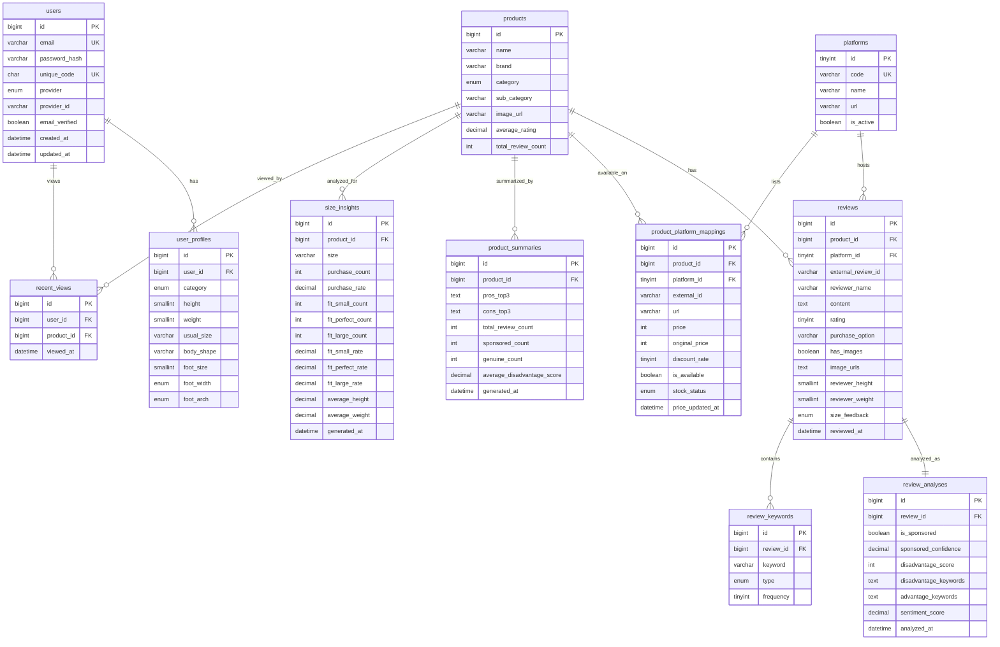

# ERD (Entity Relationship Diagram)

이 문서는 리뷰 모으기 서비스의 데이터베이스 ERD를 시각화합니다.

---

## Mermaid ERD 다이어그램



---

## 관계 설명

### 1:N 관계

| 부모 (1) | 자식 (N) | 관계 설명 | 외래키 제약 |
|---------|---------|----------|------------|
| users | user_profiles | 사용자 1명은 카테고리별로 N개의 프로필을 가질 수 있음 | CASCADE |
| users | recent_views | 사용자 1명은 N개의 최근 본 상품 이력을 가짐 | CASCADE |
| platforms | reviews | 플랫폼 1개에 N개의 리뷰가 수집됨 | RESTRICT |
| platforms | product_platform_mappings | 플랫폼 1개에 N개의 상품이 등록됨 | RESTRICT |
| products | reviews | 상품 1개에 N개의 리뷰가 존재 | CASCADE |
| products | product_platform_mappings | 상품 1개가 N개의 플랫폼에 등록됨 | CASCADE |
| products | product_summaries | 상품 1개에 1개의 요약 정보 (1:1) | CASCADE |
| products | size_insights | 상품 1개에 사이즈별 N개의 인사이트 | CASCADE |
| products | recent_views | 상품 1개가 N명의 사용자에게 조회됨 | CASCADE |
| reviews | review_analyses | 리뷰 1개에 1개의 분석 결과 (1:1) | CASCADE |
| reviews | review_keywords | 리뷰 1개에 N개의 키워드가 추출됨 | CASCADE |

### 외래키 제약 정책

**CASCADE**
- 부모 레코드 삭제 시 자식 레코드도 함께 삭제
- 사용 예: users 삭제 → user_profiles, recent_views 함께 삭제
- 사용 예: products 삭제 → reviews, product_summaries, size_insights 함께 삭제

**RESTRICT**
- 자식 레코드가 존재하면 부모 레코드 삭제 불가
- 사용 예: reviews가 존재하는 platform은 삭제 불가 (데이터 무결성 보호)

---

## 테이블별 주요 인덱스

### users
- PRIMARY KEY: `id`
- UNIQUE KEY: `email`, `unique_code`, `(provider, provider_id)`
- INDEX: `email_verified`, `created_at`

### user_profiles
- PRIMARY KEY: `id`
- UNIQUE KEY: `(user_id, category)` - 사용자당 카테고리별 1개 프로필
- INDEX: `category`
- FOREIGN KEY: `user_id` → `users.id`

### platforms
- PRIMARY KEY: `id`
- UNIQUE KEY: `code`

### products
- PRIMARY KEY: `id`
- INDEX: `category`, `brand`, `name(100)`, `average_rating`
- FULLTEXT INDEX: `(name, brand)` - 전문 검색

### product_platform_mappings
- PRIMARY KEY: `id`
- UNIQUE KEY: `(product_id, platform_id)` - 상품-플랫폼 조합 중복 방지
- INDEX: `platform_id`, `price`, `price_updated_at`
- FOREIGN KEY: `product_id` → `products.id`, `platform_id` → `platforms.id`

### reviews
- PRIMARY KEY: `id`
- UNIQUE KEY: `(platform_id, external_review_id)` - 중복 수집 방지
- INDEX: `product_id`, `rating`, `reviewed_at`, `has_images`, `size_feedback`
- FOREIGN KEY: `product_id` → `products.id`, `platform_id` → `platforms.id`

### review_analyses
- PRIMARY KEY: `id`
- UNIQUE KEY: `review_id` - 리뷰당 1개 분석
- INDEX: `is_sponsored`, `disadvantage_score`
- FOREIGN KEY: `review_id` → `reviews.id`

### review_keywords
- PRIMARY KEY: `id`
- INDEX: `review_id`, `keyword`, `type`
- FOREIGN KEY: `review_id` → `reviews.id`

### product_summaries
- PRIMARY KEY: `id`
- UNIQUE KEY: `product_id` - 상품당 1개 요약
- INDEX: `generated_at`
- FOREIGN KEY: `product_id` → `products.id`

### size_insights
- PRIMARY KEY: `id`
- UNIQUE KEY: `(product_id, size)` - 상품-사이즈 조합 중복 방지
- INDEX: `generated_at`
- FOREIGN KEY: `product_id` → `products.id`

### recent_views
- PRIMARY KEY: `id`
- INDEX: `(user_id, viewed_at DESC)` - 사용자별 최근 조회 이력
- INDEX: `product_id`
- FOREIGN KEY: `user_id` → `users.id`, `product_id` → `products.id`

---

## 카테고리별 확장성

### 현재 지원 (v1.0)
- **패션**: 체형 프로필 (키, 몸무게, 사이즈, 발 사이즈 등)
- **패션**: 사이즈 인사이트 (사이즈별 구매 통계, 핏 피드백)

### 향후 확장 (v2.0+)

#### 뷰티 카테고리
- `user_profiles`: `skin_type`, `skin_tone`, `skin_concerns` 활성화
- 새 테이블: `skin_tone_insights` (피부톤별 색조 추천)

#### 가전 카테고리
- `user_profiles`: `housing_type`, `family_size`, `usage_environment` 활성화
- 새 테이블: `usage_insights` (사용환경별 추천)

#### 식품 카테고리
- `user_profiles`: `allergies`, `diet_type`, `family_composition` 활성화
- 새 테이블: `dietary_insights` (식단별 추천)

---

## 데이터 흐름

### 1. 리뷰 수집 파이프라인

```
크롤러
  ↓
platforms (플랫폼 정보)
  ↓
products (상품 정보 생성/업데이트)
  ↓
product_platform_mappings (가격 정보 저장)
  ↓
reviews (리뷰 수집)
  ↓
review_analyses (AI 분석: 광고성, 단점 점수)
  ↓
review_keywords (키워드 추출)
  ↓
product_summaries (장단점 Top 3 집계)
  ↓
size_insights (사이즈별 통계 집계, 패션만)
```

### 2. 사용자 상품 조회 흐름

```
사용자 로그인
  ↓
products (상품 검색)
  ↓
recent_views (최근 본 상품 기록)
  ↓
product_platform_mappings (가격 비교 조회)
  ↓
product_summaries (리뷰 요약 조회)
  ↓
size_insights (사이즈 인사이트 조회, 패션만)
  ↓
reviews + review_analyses (리뷰 목록 조회, 필터링)
  ↓
user_profiles (체형 프로필 기반 유사 체형 리뷰 필터링)
```

---

## 성능 최적화 전략

### 1. 인덱스 전략
- 검색 성능: FULLTEXT INDEX (`products.name`, `products.brand`)
- 필터링 성능: INDEX (`review_analyses.is_sponsored`, `reviews.rating`)
- 정렬 성능: INDEX (`review_analyses.disadvantage_score`, `reviews.reviewed_at`)
- 복합 인덱스: INDEX (`user_id`, `viewed_at DESC`) for recent_views

### 2. Denormalization
- `products.average_rating`, `products.total_review_count`: 집계 성능 향상
- `product_summaries`: 리뷰 요약 사전 계산
- `size_insights`: 사이즈별 통계 사전 계산

### 3. 파티셔닝 (대용량 데이터 대비)
- `reviews`: `reviewed_at` 기준 연도별 파티셔닝
- `recent_views`: `viewed_at` 기준 월별 파티셔닝

---

**문서 끝**
